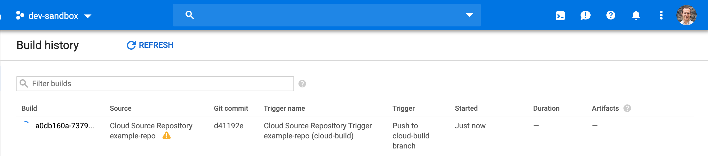

# Cloud Build and Cloud Source Repositories Example

The following example shows how you can set up an automated CI/CD pipeline using [Google Cloud Build](https://cloud.google.com/cloud-build/)
and a [Google Kubernetes Engine (GKE) cluster](https://cloud.google.com/kubernetes-engine/) that is triggered from a
[Google Cloud Source Repository](https://cloud.google.com/source-repositories).

## What is Google Cloud Build?

Cloud Build lets you build software quickly across all languages. Get complete control over defining custom workflows
for building, testing, and deploying across multiple environments such as VMs, serverless, Kubernetes, or Firebase.
You can find out more on the [Cloud Build](https://cloud.google.com/cloud-build/) website.

## What is a Google Cloud Source Repository?

A Google Cloud Source Repository is a fully featured, private [Git](https://git-scm.com/) repository hosted on Google
Cloud Platform. These repositories let you develop and deploy an app or service in a space that provides collaboration
and version control for your code. You can find out more on the [Cloud Source Repositories documentation](https://cloud.google.com/source-repositories/docs/).

## Overview

In this guide we will walk through the steps necessary to set up a CI/CD pipeline using Cloud Source Repositories, Cloud
Build and a GKE cluster. Here are the steps:

1. [Install the necessary tools](#installing-necessary-tools)
1. [Configure Cloud Build](#configuring-cloud-build)
1. [Apply the Terraform code](#apply-the-terraform-code)
1. [Trigger a build by pushing changes to the Cloud Source Repository](#triggering-a-build)
1. [View the deployment on a GKE cluster](#viewing-the-deployment)

## Installing necessary tools

In addition to `terraform`, this guide relies on the `gcloud` and `kubectl` tools to view build information and manage
the GKE cluster. This means that your system needs to be configured to be able to find `terraform`, `gcloud`, `kubectl`
client utilities on the system `PATH`. Here are the installation guides for each tool:

1. [`gcloud`](https://cloud.google.com/sdk/gcloud/)
1. [`kubectl`](https://kubernetes.io/docs/tasks/tools/install-kubectl/)
1. [`terraform`](https://learn.hashicorp.com/terraform/getting-started/install.html)

Make sure the binaries are discoverable in your `PATH` variable. See [this Stack Overflow
post](https://stackoverflow.com/questions/14637979/how-to-permanently-set-path-on-linux-unix) for instructions on
setting up your `PATH` on Unix, and [this
post](https://stackoverflow.com/questions/1618280/where-can-i-set-path-to-make-exe-on-windows) for instructions on
Windows.

## Configuring Cloud Build

Your GCP project needs to be configured properly in order to use this example. This is necessary to allow Cloud Build
to access resources such as the GKE cluster.

1. If you haven't already done so, ensure the [Cloud Build API is enabled](https://console.cloud.google.com/flows/enableapi?apiid=cloudbuild.googleapis.com) in your GCP project.
   - Alternatively you may run: `gcloud services enable cloudbuild.googleapis.com --project=$PROJECT`
1. Next you will need to ensure the Cloud Build service account is able to access your project's GKE clusters:
   - `$ PROJECT_NUM=$(gcloud projects list --filter="$PROJECT" --format="value(PROJECT_NUMBER)" --project=$PROJECT)`
   - `$ SERVICE_ACCOUNT=${PROJECT_NUM}@cloudbuild.gserviceaccount.com`
   - `$ gcloud projects add-iam-policy-binding $PROJECT --member=serviceAccount:$SERVICE_ACCOUNT --role=roles/container.developer --project=$PROJECT`

For more information on the Cloud Build service account, refer to Appendix A at the bottom of this document.

## Apply the Terraform Code

Now that we have configured Cloud Build, we are ready to deploy all of the example resources and also set up the Cloud
Build triggers!

1. If you haven't already, clone this repo:
   - `$ git clone https://github.com/gruntwork-io/terraform-google-ci.git`
1. Make sure you are in the `cloud-build-csr-gke` example folder:
   - `$ cd examples/cloud-build-csr-gke`
1. Initialize terraform:
   - `$ terraform init`
1. Check the terraform plan:
   - `$ terraform plan`
1. Apply the terraform code:
   - `$ terraform apply`
   - Fill in the required variables based on your needs. For example:
   - `project = "project-name-123456"`
   - `region = "europe-west3"`
   - `location = "europe-west3"`
   - `repository_name = "example-repo"`
   - `branch_name = "master"`
   - `cluster_name = "example-private-cluster"`

This Terraform code will:

- Create a VPC network to contain the resources
- Deploy a publicly accessible GKE cluster
- Create a repository on Cloud Source Repositories
- Deploy a GCR repository for storing build artifacts
- Create a Cloud Build Trigger to trigger builds in response to Cloud Source Repository changes.

At the end of `terraform apply`, you should now have a working CI/CD pipeline deployed in Google Cloud Platform.

## Triggering a Build

To trigger a build we need to commit and push some changes to the Cloud Source Repository. For the purposes of this
example, we have prepared a [sample GitHub repository](https://github.com/gruntwork-io/sample-app-docker) with a
basic application. We recommend you clone this repository and push it to the Cloud Source Repository that was created
in the previous step.

1. Clone the `sample-app-docker` repo to an empty directory outside of this example:
   - `$ git clone https://github.com/gruntwork-io/sample-app-docker.git`
1. Add the the Cloud Source Repository as a remote:
   - `$ git remote google ssh://[EMAIL]@source.developers.google.com:2022/p/[PROJECT_ID]/r/[REPO_NAME]`
   - **Note:** Be sure to replace the [EMAIL] (Google IAM user's address), [PROJECT_ID] and [REPO_NAME] with your values.
1. Push the sample app to the Cloud Source Repository
   - `$ git push --all google`

After you've pushed the changes to Google Source Repositories, Cloud Build will automatically trigger a new build. You
can view the build status directly in the [GCP console](https://console.cloud.google.com/cloud-build/builds).



Or by using the `gcloud` CLI tool:

```
$ gcloud builds list --limit=5
```

During the build Cloud Build will install the sample app's dependencies, execute the tests, build a docker image,
push it to the GCR registry then create a deployment on the GKE cluster.

## Viewing the Deployment

If the build completed successfully, it should have been deployed to the GKE cluster and exposed as a service using a
Load Balancer. We can verify this by checking the output using `gcloud`:

1. View the most recent builds and copy the build id:
   - `$ gcloud builds list --limit=5`
1. Stream the logs for the most recent build and find the service details:
   - `$ gcloud builds log <BUILD_ID>`
1. Open the external IP in your browser:
   - `$ open <EXTERNAL_IP>`

Or by using the `kubectl` command:

1. Configure `kubectl` to use the GKE cluster:
   - `$ gcloud container clusters get-credentials example-private-cluster --region europe-west3`
1. List the available services:
   - `$ kubectl get services`
1. Open the external IP in your browser:
   - `$ open <EXTERNAL_IP>`

## Appendix A: Cloud Build Service Account

Cloud Build executes your builds using a service account, a special Google account that executes builds on your behalf. The email for
the Cloud Build service account is `[PROJECT_NUMBER]@cloudbuild.gserviceaccount.com`. When you enable the Cloud Build API, the service
account is automatically created and granted the Cloud Build Service Account role for your project. This role is sufficient for severa;
tasks, including fetching code from Cloud Source Repositories, pushing and pulling Docker images to Container Registry, however it
does not allow Cloud Build to deploy to Kubernetes Engine clusters. Therefore you need to manually enable our service account to
perform these actions by granting the account additional IAM roles. For more information, refer to: https://cloud.google.com/cloud-build/docs/securing-builds/set-service-account-permissions.
